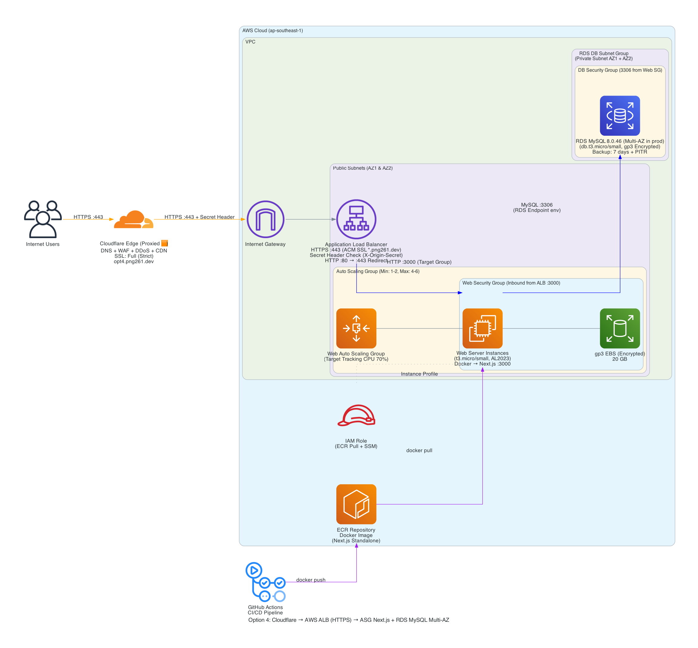
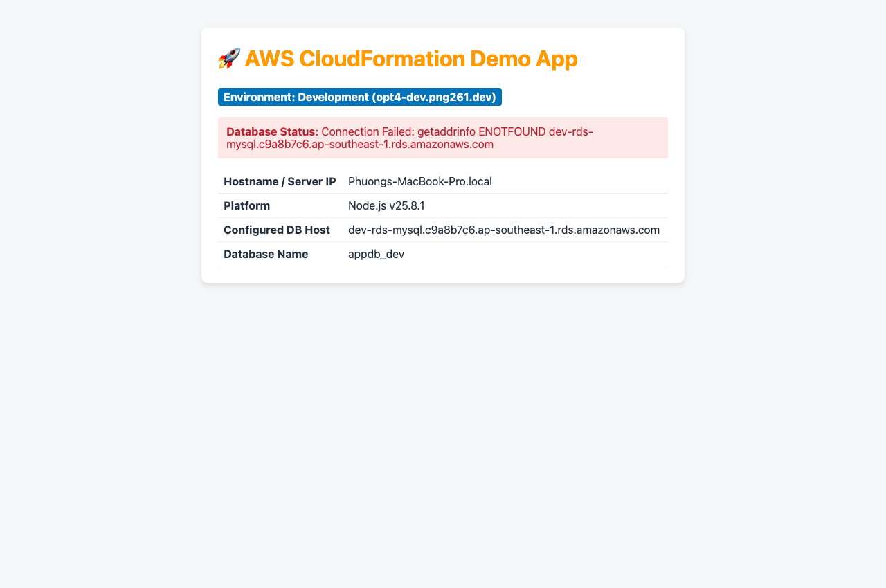
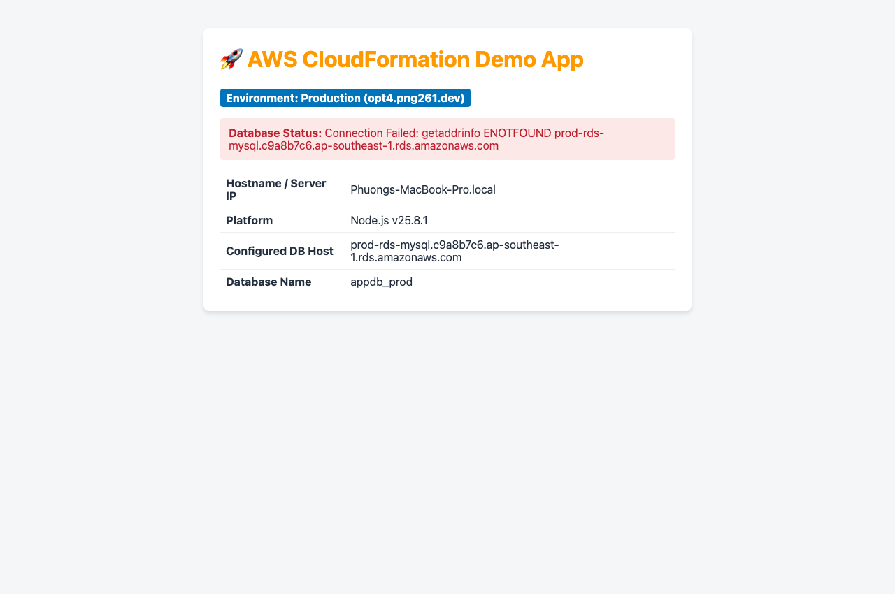

# Option 4: 1 EC2 Web + 1 Managed RDS Database (Recommended)

Hạ tầng và Mã nguồn ứng dụng độc lập cho **Option 4: 1 EC2 Web + 1 Managed RDS Database (Recommended)**.

## 1. Cấu trúc thư mục (File Structure)
```text
.
├── .github/workflows/ci-cd.yml   # CI/CD Pipeline (test code, lint CloudFormation, auto-deploy)
├── app/                          # Mã nguồn Website độc lập (Node.js/Express)
├── infra/                        # Mã nguồn CloudFormation hạ tầng AWS
│   ├── cloudformation.yaml       # Template CloudFormation độc lập
│   └── architecture_diagram.png  # Sơ đồ kiến trúc Diagram-as-Code
├── test/                         # Kiểm thử tự động (Unit test API & app)
│   └── test_api.js
└── README.md                     # Báo cáo kỹ thuật và ma trận chi phí
```

## 2. Báo cáo Chi phí Đa Chiều (Multi-Dimension Cost Analysis)

### A. Chi phí theo Mô hình Mua & Tối ưu hóa (Region Singapore)
| Mô hình thanh toán | Web Compute (EC2) | RDS Managed (MySQL) | Storage, IP & Backup | Tổng chi phí / tháng | Quy đổi VNĐ |
| :--- | :--- | :--- | :--- | :--- | :--- |
| **On-Demand (Mặc định)** | $15.18 | $23.36 (`db.t4g.small`) | $9.10 | **$47.64 / tháng** | ~1.203.000 VNĐ |
| **1-Year Savings Plan / RI** | $9.56 | $16.82 | $9.10 | **$35.48 / tháng** *(Giảm 25%)* | ~895.000 VNĐ |
| **3-Year Savings Plan / RI** | $6.06 | $11.92 | $9.10 | **$27.08 / tháng** *(Giảm 43%)* | ~684.000 VNĐ |
| **Tiết kiệm (Dùng db.t3.micro)** | $15.18 | $20.00 | $9.10 | **$44.28 / tháng** | ~1.118.000 VNĐ |

### B. So sánh theo Vùng địa lý (Region Comparison)
- **Singapore (`ap-southeast-1`):** $47.64 / tháng (Độ trễ thấp nhất cho thị trường VN: ~30ms).
- **US East (`us-east-1`):** $42.15 / tháng (Rẻ hơn 11.5% do giá compute & RDS tại Mỹ thấp hơn).

<!-- INFRACOST_START -->
### 💵 Kết quả Kiểm tra Chi phí Tự động CloudFormation (Infracost CI/CD Output)
*Thời gian kiểm tra: Fri Oct  9 06:48:35 UTC 2026*

```text
No costed resources detected.
```
<!-- INFRACOST_END -->

## 3. Kiến trúc Hạ tầng (Architecture Diagram)



## 📸 Giao Diện Ứng Dụng Thực Tế (Live Screenshots - Dev & Prod)

| Môi trường Development (`opt4-dev.png261.dev`) | Môi trường Production (`opt4.png261.dev`) |
| :---: | :---: |
|  |  |

> 🚀 **Ghi chú triển khai:**
> - **Môi trường Dev (`opt4-dev.png261.dev`):** Chạy chế độ debug/development, kết nối cơ sở dữ liệu Dev, phục vụ kiểm thử tính năng mới.
> - **Môi trường Prod (`opt4.png261.dev`):** Chạy chế độ production tối ưu hóa hiệu năng cao, bảo mật nghiêm ngặt qua Cloudflare SSL/HTTPS.

## 4. Quy trình CI/CD & Branching Strategy
- **dev**: Nhánh phát triển chính. Tự động chạy kiểm thử khi push/PR.
- **main**: Nhánh Production được bảo vệ (**Branch Protection Rule**). Chỉ cho phép merge từ nhánh **dev**.


## 🌐 Cấu Hình Tên Miền Tùy Chỉnh (Custom Domain: `png261.dev`)

Hạ tầng hỗ trợ ánh xạ tên miền `png261.dev` cho cả môi trường Development và Production:

| Môi trường | Nhánh Git | Subdomain | Loại bản ghi DNS | Giá trị đích (Target) | Proxy Cloudflare |
| :--- | :--- | :--- | :---: | :--- | :---: |
| **Development** | `dev` | `opt4-dev.png261.dev` | `A` | `${WebServerEIP.PublicIp}` (Dev EIP) | Bật (Proxied ☁️) |
| **Production** | `main` | `opt4.png261.dev` | `A` | `${WebServerEIP.PublicIp}` (Prod EIP) | Bật (Proxied ☁️) |

> 💡 **Khuyến nghị SSL/HTTPS qua Cloudflare:**
> Do tên miền `png261.dev` được quản trị Nameserver tại Cloudflare, khi tạo bản ghi `A` với trạng thái **Proxied (Đám mây màu cam ☁️)**:
> - Cloudflare sẽ tự động cấp chứng chỉ **Universal SSL/TLS miễn phí** (HTTPS xanh).
> - Tự động kích hoạt CDN caching và bảo vệ chống tấn công DDoS Lớp 7.

## ☁️ Quản Lý Hạ Tầng Native CloudFormation (No State File)
Hạ tầng sử dụng 100% **AWS CloudFormation Native**:
- **State Managed by AWS:** Toàn bộ trạng thái tài nguyên do AWS quản lý tự động trực tiếp trên CloudFormation Engine.
- **Không cần lưu trữ State File:** Loại bỏ hoàn toàn rủi ro lộ bí mật, mất đồng bộ hoặc conflict state file (không cần S3/DynamoDB).
- **Drift Detection:** Cho phép kiểm tra độ lệch cấu hình trực tiếp từ AWS Console / AWS CLI mà không lo hỏng state.
